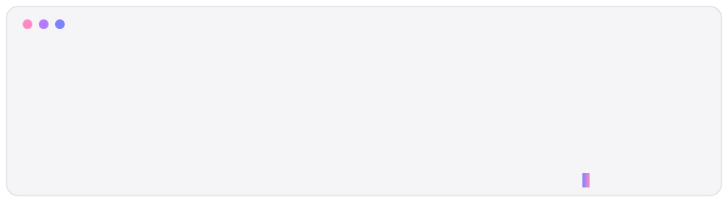
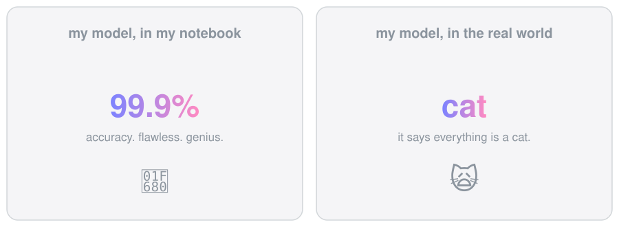
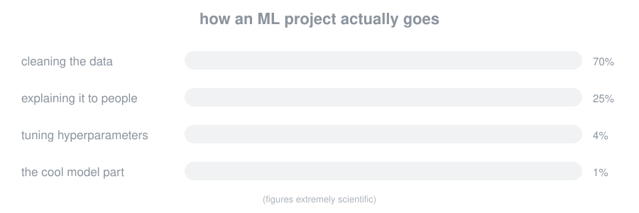

**CS grad (First Class) · ML nerd · exploring the business side of products**

 

## the short version

I like teaching machines to do clever things. Lately I also like asking the question that comes right after: *okay, but who is this for, and would they pay for it?*

So this profile is what happens when a machine learning nerd starts reading pitch decks for fun.

 

## two brains, one keyboard

 

## reality check

 

 

## toolbox

 

## the numbers

 

## contribution garden

 

Got a model that says everything is a cat? Or a business idea that needs one? <a href="mailto:wimukthideshan@gmail.com">Let's talk</a>.

